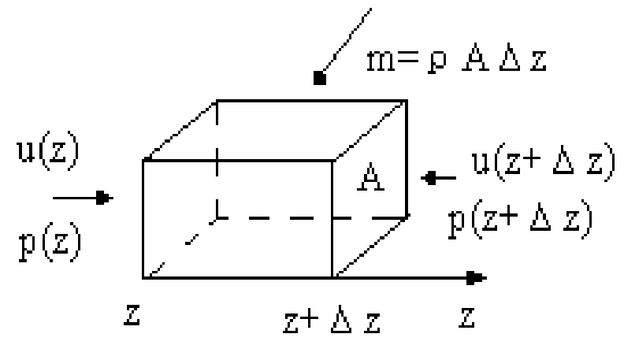
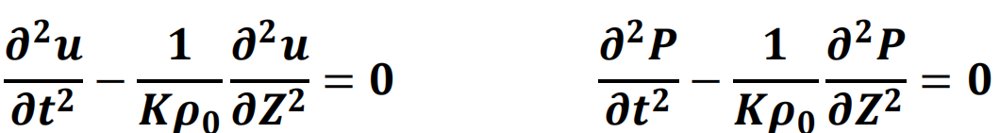
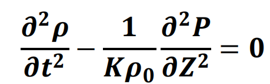

# 超声波讲座项目
这是复旦大学于超声波技术讲座的一个项目（作业）。

## 波的基本参数
- 频率：f（Hz，KHz，MHz，GHz...）
- 周期：T（s，ms，μs）
- 波长：λ（m，mm，μm...）
- 波速：C（m/s，Km/s）
- 关系：f = 1/T，λ = C/f

## 超声波的叠加原理
- 当多个波相遇时，相遇点的粒子位移是每个波引起的位移的矢量和（叠加性质）。
- 相遇后，每个波保留其原始特性（独立性）。
- 超声波的干涉：
    - 当两个具有相同频率和振动方向的波（相干波）相遇时，它们可以增强或相互抵消，从而在空间中产生振动增强或减弱的现象。
    - 驻波

## 波动方程
- 方程导出：
    - 软组织，只考虑纵波
    - 体积元
- 与波长相比非常小（微元）
- 包含足够多的振动粒子（连续介质）
- 截面积： A
- 质量： m=ρAΔz
- 声压：p(z) 和 p(z+Δz)
- 质点运动速度： u(z) 和 u(z+Δz)

方程导出时几个假设条件
- 介质中传播的横波可以忽略（软组织的切向弹性模量极小）。
- 小的声功率（体积元密度变化小，与声压成正比）。
- 传播中满足绝热条件。
- 没有考虑介质吸收等原因引起的声衰减。

波动方程的解
- 对于平面正弦波： p = p+ * sin(ωt - kz)。
    其中，p+为声压的振幅，ω为声压的角频率，k为波数，声波沿z方向传播。
- 代入波动方程：
    

- 色散公式： k^2 = ρ0 * K * ω^2。
- 色散公式表示介质性质与在介质传播的声波特性之间的关系。

